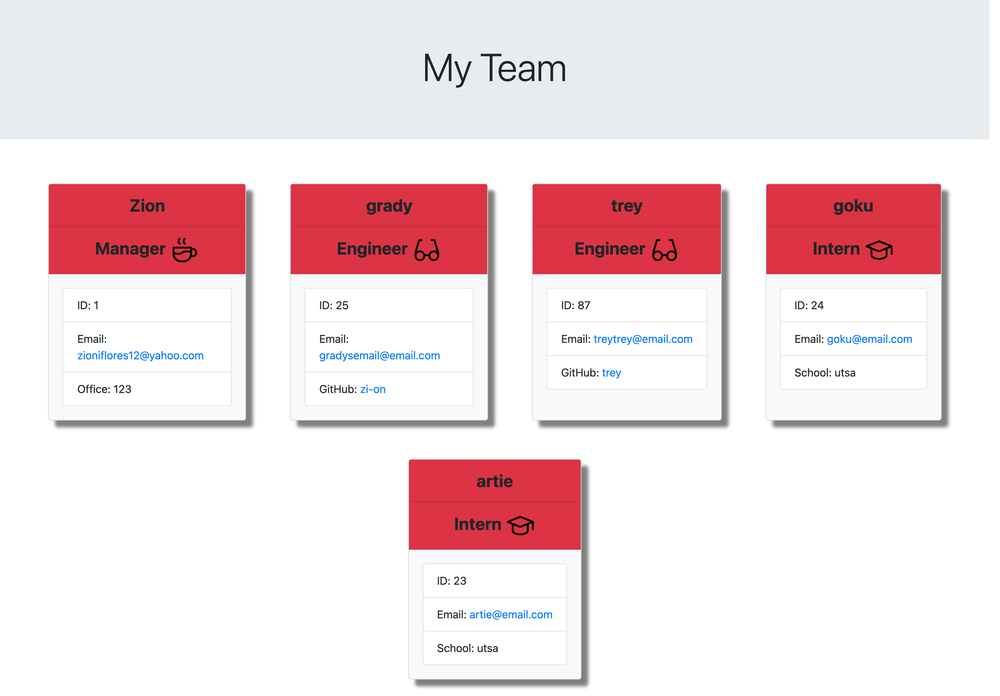

# Team-Profile-Gen

    
## Description 
You are able to create team profiles that can be viewed as a website.

## Table of Contents
- [Installation](#installation)
- [Usage](#usage)
- [Contribution](#contribution)
- [Tests](#tests)
- [License](#license)
- [Contact Me](#contact-me)

## Installation
1. have node.js installed
2. run npm install to install dependencies
3. run npm run test in terminal to run tests
4. run node index to generate team profile

## Usage
used to create team profiles.

## Contribution
Zion Flores

## Tests
tests were ran using jest

## License
MIT

</img>

## Contact Me
GitHub: https://github.com/Zi-on

Email: zioniflores12@yahoo.com